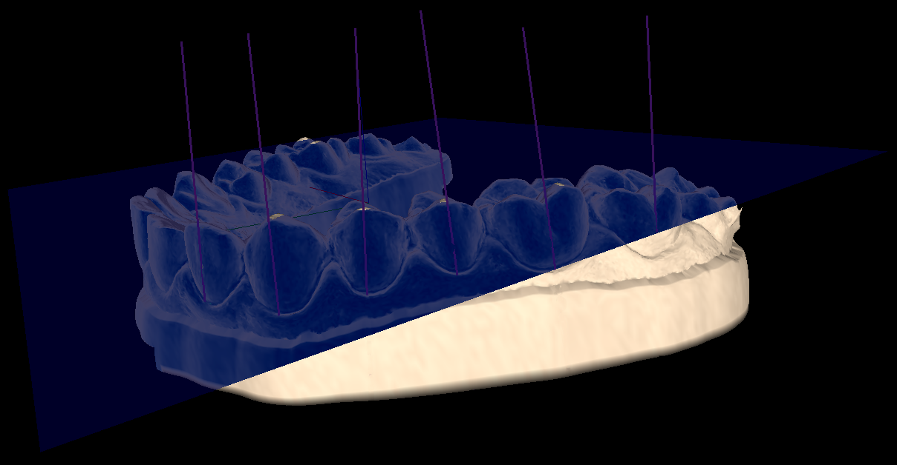
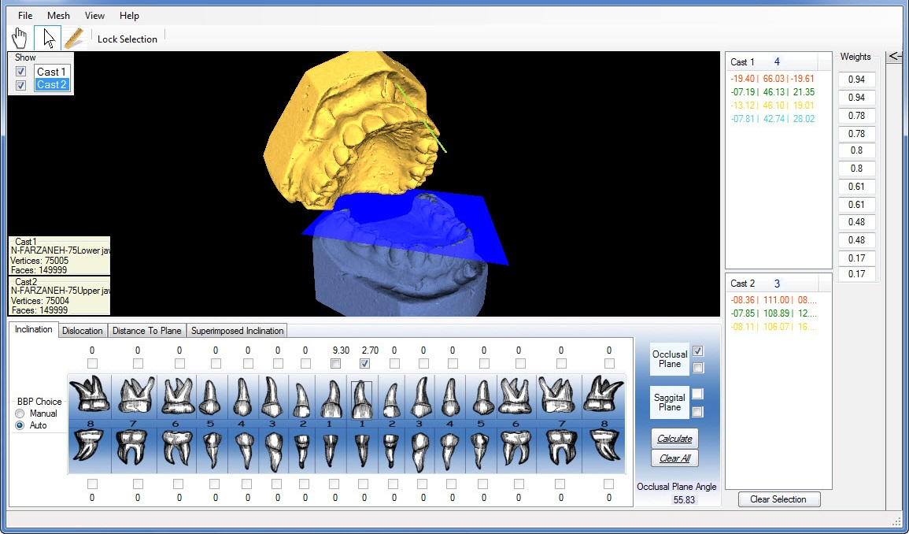

# OrthoAid
The OrthoAid is an in-house software, developed at the Shahid Beheshti University of Medical Sciences (SBMU) in collaboration with the University of British Columbia (UBC), to help orthodontists analyze pre and post operative 3D dental study models. 

### Executable Software (for windows):
You can download the latest released version here:
[OrthoAid_V11.4.zip](https://github.com/amir-abdi/OrthoAid/raw/master/Release/OrthoAid_V11.4.zip).
The executables are built for windows. If you ran into problems running the application, please consider posting an issue [here](https://github.com/amir-abdi/OrthoAid/issues).

### Source Code

OrthoAid is developed with C#.NET and the source code is available in this repository. 
For a seamless development, consider openning the solution file (`OrthoAid_Solution.sln`) with [Visual Studio 2017](https://visualstudio.microsoft.com/vs/community/) or above. The Community version of Visual Studio is freely available. 

### Features

OrthoAid comes with the following functionalities:
- Draw occlusal and sagittal planes
- Calculate inclination of teeth to the occlusal plane
- Superimpose serial models on selected fiducials, using weighted least square method, and calculate distance between landmarks (e.g. tooth movements)
- Calculate distance of each point ot occlusal and sagittal planes
- Fit polynomial curve on selected lingual and buccal bracket points
- Choose the best arch wire available based on the lingual or buccal curvature of the dental arch

### How to use

In  mode:

- Rotate around X and Y dimensions: Hold left mouse button down and drag (Hotkeys: A, D, W, S)
- Rotate around Z dimension: Hold middle mouse button down and drag (Hotkeys: Q, E)
- Translate: Hold right mouse button down and drag (Hotkeys: Arrow Keys Up, Down, Left, Right)
- Zoom in/out: Scroll with the middle mouse button (Hotkeys: Page Up, Page Down)

In  mode:

- Select point on the mesh: Click on the point
- Select multiple points on the mesh: Hold `Ctrl`  down and click on the points

In  mode:

- Measure distance of two points: Hold the left mouse button down from the source point, drag the pointer and release the left mouse button on the target point. The distance will be shown on the infobar at the bottom of the window.

#### Hotkeys

- Rotate around X and Y dimensions: Hotkeys: A, D, W, S
- Rotate around Z dimension: Hotkeys: Q, E
- Translate: Hotkeys: Arrow Keys Up, Down, Left, Right
- Zoom in/out: Hotkeys: Page Up, Page Down

Figure 1. A sample cast with its occlusal plane drawn and inclination vectors on selected teeth.
 
 
 
 

Figure 2. The upper and lower models are loaded in OrthoAid, inclination angle of the upper central incisor is calculated, and the occlusal plane of the lower incisor is drawn.
